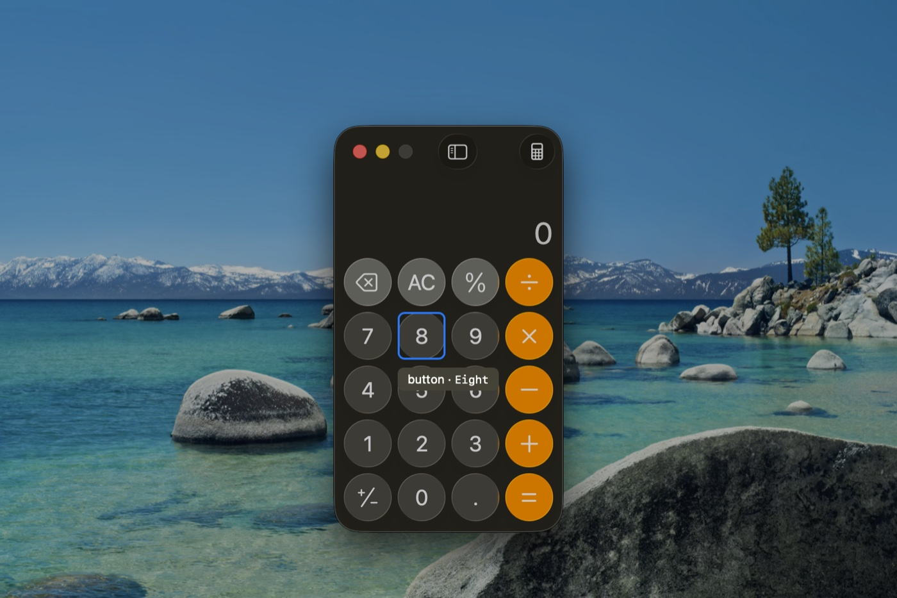
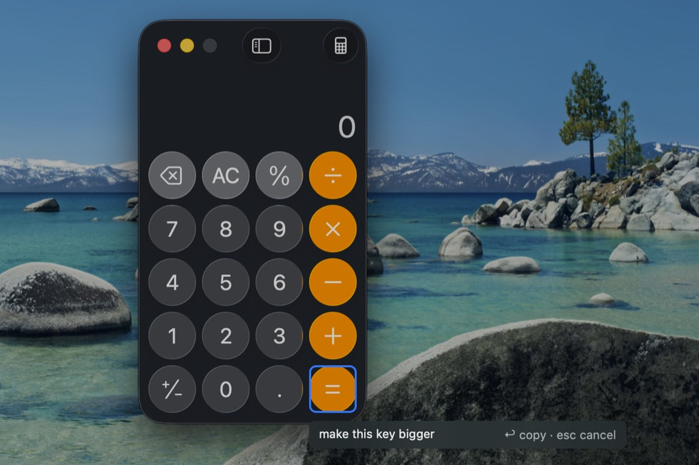
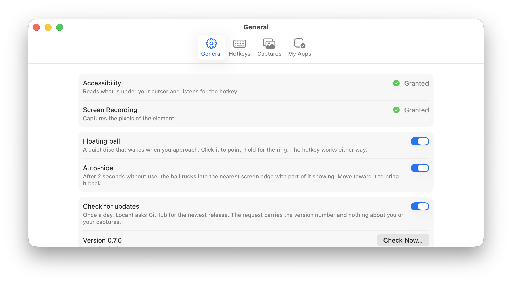

<p align="center">
  
</p>

<h1 align="center">Locant</h1>

<p align="center">
  <b>Point, don't describe.</b><br>
  Point at one element in any Mac app. Your coding agent gets the element, not a screenshot.<br>
  Free, macOS 15+, Apple silicon and Intel.
</p>

<p align="center">
  <a href="https://github.com/Malik1942/locant/releases/latest"></a>
  
  <a href="https://github.com/Malik1942/locant/releases"></a>
</p>

<p align="center">
  
  <br><sub>Hover shows the element and its identifier. Nothing is written until Enter.</sub>
</p>

<p align="center">
  <a href="https://locant.malikzhang.com">Website</a> ·
  <a href="https://github.com/Malik1942/locant/releases/latest/download/Locant.dmg">Download</a> ·
  <a href="schema/capture.schema.json">Payload schema</a>
</p>

## Why

A screenshot tells a coding agent roughly where something is. It then guesses which view drew it, and
the first guess is often wrong.

Every native Mac app already carries the answer in its accessibility tree: a role, a label, and often
the exact identifier the source code uses. Locant reads it. Press a hotkey, click one element in any
app, type what should change, press Enter. The clipboard now holds a Markdown payload with the
element's role, label, accessibility identifier, frame, and ancestry, plus a cropped PNG, so the agent
can grep for the right file on the first try.

Window-level tools give your agent the window. Locant gives it the element.

## Install

1. [Download Locant.dmg](https://github.com/Malik1942/locant/releases/latest/download/Locant.dmg) and
   drag Locant to Applications. Signed with a Developer ID and notarized, so it opens like any other app.
   To update, do the same over the old copy; the permissions carry over.
2. Launch it. There is no Dock icon; look for the pointing hand in the menu bar.
3. Allow the two permissions it asks for, in this order:
   - **Accessibility** reads what is under your cursor and listens for the hotkey. Without it nothing works.
   - **Screen Recording** captures the pixels of the element. macOS applies a fresh grant after a relaunch,
     and Locant offers to do that itself.

   There is no third prompt. Nothing leaves the machine: no telemetry, no accounts. The one request Locant
   makes is a daily check for a newer release on GitHub; turn it off in Settings › General.
4. A one-page guide opens: every action, its hotkey, and the gestures on the overlay. Close it; reopen it
   any time from Settings › General. The first three times each action opens, a line at the bottom of the
   screen names its gestures, then fades by itself.

## Use

Three seconds, start to paste.

1. **⌃⌃** (double-tap Control within 350 ms), or click the ball. The screen freezes under the overlay.
   Hover to see the highlight and the label `role · identifier`. The label tells you before you click
   whether the element has a declared identifier, only a label, or no accessibility tree at all.
2. **Click** the element, or press **Return** while it is highlighted. Drag instead to capture a frame
   with everything inside it. **Option** steps to the parent, and again for the next level.
3. **Type** what should change, press **Enter**. The payload is on the clipboard. **Esc** at any point
   cancels; nothing is written and the clipboard is untouched.

<p align="center">
  
</p>

Paste into your agent. Each capture also lands in `~/Pictures/Locant/` as a PNG and a JSON sidecar that
validates against [`schema/capture.schema.json`](schema/capture.schema.json).

```
## Locant capture (fix)
Image: /Users/you/Pictures/Locant/locant-simulator-20260913-153012-k7q2.png
App: Simulator (com.example.myapp) · Window: iPhone 17 Pro
Captured: 2026-09-13 15:30 · Image region: 450×130 pt @2x (element + 40 pt)
Project: /Users/you/Developer/MyApp

### Target element
button · id=captureButton
Frame: x=43 y=894 w=370 h=50
Path: application > window > group > group > button#captureButton

### Note
make this rounded, match the other pills
```

The image path comes first because terminal agents receive only the text on paste; the path lets them
open the PNG themselves.

## What it does

**Point**, the primary action

- **Element, identifier, path.** The accessibility identifier is what the agent greps for. The path
  says where in the tree the element sits.
- **A ladder when there is no element.** Identifier, then label, then a drawn frame with every element
  inside it listed, then recognized text and the nearest labeled neighbors, then the image alone. The
  payload says which rung it reached.
- **Fix or reference is inferred.** Anything in the iOS Simulator, anything built on this Mac, and
  anything signed with your own Team ID counts as yours; the payload carries a `Project:` line. My Apps
  in Settings is only for what inference misses.
- **Files in Pictures, tagged in Finder** with Locant, the app, fix or reference, and the project.
  Optionally sorted into subfolders by app, project, or month.

**Four more actions**, on the same gesture. Hold the ball for half a second and release on one, or use
the hotkey.

- **Snap** (⌃⌥2): a window or a dragged region as a PNG. Hold ⌥ at release to keep it off disk.
- **Text** (⌃⌥3): the text in an element or a region, recognized, to the clipboard. Nothing on disk.
- **Color** (⌃⌥4): a magnifier follows the cursor; arrows nudge by a pixel, click copies the value.
  Hex, rgb(), hsl(), or SwiftUI Color, in sRGB or Display P3.
- **Cut** (⌃⌥5): the subject cut onto a transparent background.

**And**

- **Before & After.** After the agent's edit, run your app again. Locant finds the same element,
  captures it when it looks different, and keeps every iteration with the git diff beneath.
- **The floating ball**, a glass disc at the edge of the screen that stays out of the way until you
  reach for it. Turn it off in Settings; the hotkey works either way.
- **Retention.** Images older than 30 days go to the Trash. Change the period, or keep everything.
- **Hotkeys you record**, a key with modifiers or a double-tap of one modifier, for Point and each action.
- **A daily update check**, and nothing else on the network.

<p align="center">
  
  <br><sub>Settings (⌘,): General, Hotkeys, Captures, My Apps. Every default works on first launch.</sub>
</p>

<details>
<summary><b>Full feature reference</b></summary>

| | What it does |
|---|---|
| **Overlay** | The screen freezes under a dimmed frame. Hover picks the smallest real control near the cursor and sticks to it across padding; a whole-window group appears only in blank areas. The label reads `role · identifier`, or the label, or a symbol name, so you know what the agent will get before you click. Return takes the highlighted element; Esc cancels everywhere. |
| **Drawn frames** | Drag on the overlay to capture a frame and every element inside it (`### Elements in frame`). When nothing has an identifier, the text in the image is recognized and listed, and the nearest labeled elements are named (`### Text in image`, `### Nearby`). A dragged region for Snap, Text, or Cut waits with handles until Return (**Adjust selection**, on by default). |
| **Desktop and menu bar** | Targets too. Desktop icons resolve through Finder, widgets through Notification Center, menu titles through the app that owns the menu bar, status items through Control Center or the app that placed them (`menuExtra · id=com.apple.menuextra.wifi`), Dock items through the Dock. A normal window in front of any of these wins. |
| **Mode inference** | Fix mode for your own code, reference mode for everything else. Signals: the iOS Simulator, a build found through DerivedData, a folder with an Xcode project or `Package.swift`, a bundle signed with your Team ID. When a project folder is found the payload carries `Project:`. My Apps overrides. |
| **Payload** | One pasteboard item carrying both the PNG and the Markdown. The Markdown is derived from the JSON sidecar, never the other way around; the schema is the only contract with the outside. A failed capture never touches the clipboard. |
| **Iterations** | After a Point capture in an app you build, each launch or activation of that app within a day is a chance to capture the element again. Locant refinds it by identifier, then by role and label, then by the nearest same-role frame. When the pixels differ beyond a tolerance, it records the git facts (commit at capture time versus HEAD, or the working tree when nothing was committed) and appends an iteration to the sidecar. **Show before & after** in the menu bar opens the newest: slide, side by side, or flip, with every iteration in a strip. Switch: Settings › Captures › Collect iterations. |
| **Lifecycle** | Images older than the retention period (7, 30, 90 days, or forever) move to the Trash on launch and daily, with their sidecars. Captures an agent marked `resolved` in the sidecar stay, and so do pinned ones (extended attribute `app.locant.pinned`). Actions that make text or a value keep nothing. |
| **The ball** | A 48 pt glass disc. Rests translucent, tucks into the nearest edge after two seconds without use, wakes as the cursor approaches, starts Point on click. Hold half a second for the ring: Snap ↑, Text →, Color ↓, Cut ←; release at center cancels. Drag it anywhere. |
| **Hotkeys** | Point is ⌃⌃ by default; the actions are ⌃⌥ and their number in the menu (⌃⌥1 Point through ⌃⌥5 Cut). Re-record or clear any of them in Settings › Hotkeys, which refuses a clash inside Locant and warns when a chord is also a macOS shortcut. A matched chord is swallowed before the frontmost app sees it. |
| **Updates** | Once a day, 10 s after launch, Locant asks the GitHub releases API for the newest version and offers Download, Later, or Skip This Version. The request carries the version number and nothing else. Settings › General has the switch and Check Now. |
| **Nothing to notice** | No Dock icon. Idle memory under 30 MB. Locant never appears in its own captures. |

</details>

## Works where you paste

The payload is plain Markdown, so any agent takes it on paste. Whether it also opens the image, as
of 0.7:

| Agent | Paste | Image | Status |
|---|---|---|---|
| Claude Code | Markdown text | reads the PNG from the `Image:` path | expected to work; not yet verified end to end |
| Cursor | Markdown text | reads the path | untested |
| Codex CLI | Markdown text | `view_image` on the path | untested |
| Gemini CLI / Antigravity | Markdown text | untested | untested |

Statuses say "untested" until someone tests them. A report of what your agent did with a payload is a
welcome issue.

## Known limitations

- Element quality follows the target app. SwiftUI, AppKit, and the iOS Simulator work well. Electron
  and Chromium apps (Claude, VS Code, Slack, Chrome) build their tree only when asked; Locant asks on
  first contact, and the first hover over such an app can take about half a second to sharpen. Figma,
  games, and custom-drawn UIs expose little; Locant then records `element: null`, says so in the
  payload, and still gives the agent the image and your note.
- Hover picks the smallest control and sticks to it. Press Option to step to the parent.
- iOS Simulator: which app it is showing is inferred from the most recently launched simulated process.
  With two apps in one device, the newer one is assumed. The tree is built lazily; Locant retries for up
  to 600 ms before giving up.
- Safari and Chrome tab URLs are not read yet, so `url` is always null and the localhost rule for fix
  mode is dormant.
- Menus and popovers stay open under the overlay, but an element inside another app's menu may not resolve.
- Snap and Cut on a click take a normal window only, not the desktop, menu bar, or Dock.

## Under the hood

Locant's event tap matches its hotkeys and passes every other key through untouched; nothing is
logged. It never talks to the network except the release check, and stores nothing but its settings
and the captures you make.

<details>
<summary><b>How it works</b>: the hit test, the ladder, iterations</summary>

```
Locant/
  Resolve/
    AccessibilityReader.swift  owns every AXUIElement on a background actor; nothing AX-typed leaves it
    ElementResolver.swift      raw attributes of one node → ResolvedElement, pure, fixture-tested
    RegionResolver.swift       what is inside a drawn frame, which of it is primary, what is near a point
    ModeInference.swift        is this the user's own code? Simulator, DerivedData, Xcode project, Team ID
  Capture/
    HotkeyMonitor.swift        double-taps and chords; one event tap serves every binding
    ContextCollector.swift     what the user was looking at when the hotkey fired
    SelectionOverlay.swift     the frozen frame, drawn from system constants
    ScreenCapture.swift        the cropped PNG, own windows excluded from every ScreenCaptureKit call
    TextRecognizer.swift       Vision, used only when the payload would otherwise be vague
    Magnifier.swift            Color: 15×15 native pixels at 10x, following the cursor
  Payload/
    MarkdownBuilder.swift      Capture → Markdown, pure, derived from the JSON and never the reverse
    PasteboardWriter.swift     one item with PNG and text, written only after the files exist
  Verify/
    AutoVerify.swift           when a relaunch of your app is a chance to capture the element again
    ElementRefinder.swift      identifier, then role and label, then the nearest same-role frame
    ImageDiff.swift            does the element look different? channel tolerance, changed fraction
    GitFacts.swift             commit at capture vs HEAD or working tree, through /usr/bin/git, read-only
  Store/
    FileStore.swift            PNG and sidecar, nothing written until both exist
    Lifecycle.swift            the retention sweep; pinned and resolved captures stay
    Preferences.swift          UserDefaults; a fresh install works with every default
  Launcher/                    the ball, its spring, and the ring
  Modules/                     Snap, Text, Color, Cut
```

**The hit test.** Accessibility calls run on a background actor and reads are cached for 400 ms, so
hover stays smooth even in the Simulator, where each read costs about 2 ms. The overlay asks for the
smallest real control near the cursor and keeps it across padding, so a button stays a button as you
cross its margin. Electron apps build their tree on first contact; the first hover sharpens after the
tree arrives.

**The ladder.** Every capture reaches for the best reference it can and says which rung it got:
an element with a declared identifier, an element with only a label, a drawn frame with its contents
listed, recognized text plus the nearest labeled neighbors, and finally the image alone with a line
telling the developer how to make the view addressable next time. The agent always gets something
to grep, or an honest `null`.

**The data contract.** The JSON sidecar is the source of truth and validates against
`schema/capture.schema.json`; the clipboard Markdown is derived from it. Field names are platform
neutral (`role`, `label`, `identifier`, `frame`, `path`), never AX-prefixed, so another platform could
write the same shape.

**Iterations.** A Point capture in fix mode arms a watch for that app. When it launches or comes forward
within a day, Locant refinds the element, captures it, and compares pixels with a tolerance that
ignores a blinking caret or an antialiasing wobble. Only a real change records git facts and appends an
iteration to the sidecar. Locant never commits, never installs hooks, and never writes to your
repository.

```bash
xcodebuild -project Locant.xcodeproj -scheme Locant test    # 123 tests over the pure functions
```

</details>

<details>
<summary><b>Scripting</b>: every setting is a <code>defaults</code> key</summary>

Settings live in `UserDefaults` under `com.malikzhang.deixis` (the bundle identifier kept its
pre-rename value on purpose, so permissions and settings survive updates). Locant reads them at
launch, so relaunch after writing.

```bash
defaults write com.malikzhang.deixis retentionDays -int 30            # 7, 30, 90, or 0 for forever
defaults write com.malikzhang.deixis collectsIterations -bool YES
defaults write com.malikzhang.deixis checksForUpdates -bool YES
defaults write com.malikzhang.deixis ballEnabled -bool YES
defaults write com.malikzhang.deixis ballAutoHide -bool YES
defaults write com.malikzhang.deixis adjustSelection -bool YES
defaults write com.malikzhang.deixis organization -string none        # none, byApp, byProject, byMonth
defaults write com.malikzhang.deixis colorFormat -string hex          # hex, rgb, hsl, swiftUI
defaults write com.malikzhang.deixis colorSpace -string sRGB          # sRGB, displayP3
defaults write com.malikzhang.deixis captureFolder -string ~/Pictures/Locant
```

Every capture is also a file: the JSON sidecar next to each PNG in the capture folder is the same
data the clipboard carries, so a script or an MCP server can read captures without the app.

</details>

<details>
<summary><b>Build from source</b></summary>

Needs Xcode 26 and macOS 15 or later. No third-party packages.

```bash
git clone https://github.com/Malik1942/locant.git
cd locant
xcodebuild -project Locant.xcodeproj -scheme Locant -configuration Release build
```

The project signs with the developer's Apple Development identity. On another machine, set your own
team in Signing & Capabilities, or sign ad hoc on the command line with
`CODE_SIGN_IDENTITY=- CODE_SIGN_STYLE=Manual`. Ad hoc signatures change on every build, so macOS asks
for Accessibility and Screen Recording again after each rebuild; any real identity, including the free
Apple Development one that comes with an Apple ID, avoids that.

Releases are built by `scripts/release.sh` (Developer ID, hardened runtime, notarized, stapled) and
published as a GitHub release asset by `scripts/publish.sh`.

</details>

<details>
<summary><b>Troubleshooting</b></summary>

| Symptom | Fix |
|---|---|
| A permission switch is on but Locant still cannot capture, or the hotkey is dead after an update | macOS ties each grant to the app's signature, so a differently signed copy looks like a different app. In System Settings › Privacy & Security, remove Locant from Accessibility and Screen Recording and add `/Applications/Locant.app` again, or run `tccutil reset Accessibility com.malikzhang.deixis` and `tccutil reset ScreenCapture com.malikzhang.deixis`. |
| The first hover over VS Code, Slack, Chrome, or Claude is slow | Electron builds its accessibility tree on first contact. Wait about half a second; later hovers are instant. |
| The payload says `element: null` | The app exposes no accessibility tree there (Figma, games, canvases). If the view is yours, give it `.accessibilityElement()` and `.accessibilityIdentifier("…")`; Locant points at it next time. |
| A hotkey also fires a macOS shortcut | Settings › Hotkeys shows the clash. Re-record the hotkey; the defaults (⌃⌃, ⌃⌥1 to 5) are chosen because nothing else uses them. |
| No pointing hand in the menu bar | On a notched MacBook the icon hides under the notch when the bar is full. The hotkey and the ball still work. |
| The Simulator element is missed right after launch | The simulated app's tree is built lazily. Locant retries for 600 ms; hover again. |
| Rebuilt from source and asked for permissions again | Ad hoc signing. Use a real identity; see Build from source. |

</details>

<details>
<summary><b>Prior art</b></summary>

Nothing let a human point at one element in a native Mac app and hand the result to any agent when this
was written (September 2026), hence this project. Related, and worth your time:

- **Codex Appshots** and **Claude Desktop quick entry**: a whole window to one specific agent. Locant
  captures the element under the cursor and its crop, and puts it on the clipboard for any agent.
- **EYHN/appshots**: the open-source take on the same window-level idea.
- **Agentation**, **Stagewise**, **Cursor Design Mode**: click an element and get its CSS selector or
  DOM node. The same job, for web apps only.
- **Peekaboo**: the agent reads the accessibility tree itself over MCP. Locant is the human's half of
  that: the person chooses the element, the agent gets a reference.

Locant is not a screen recorder, GIF tool, or scrolling-capture tool; CleanShot X and a dozen
open-source alternatives own that.

</details>

<details>
<summary><b>The name</b></summary>

"Locant" is a term from chemical nomenclature. In a compound name such as 2-methylbutane, the "2" is
the locant: the number that tells you exactly which position on the carbon chain the methyl group is
attached to. Without it, the name describes a family of possible molecules. With it, one molecule,
unambiguously.

That is the job of this tool. A screenshot tells an agent roughly where something is. Locant tells it
exactly which element, with a reference the agent can grep for. Pronounced LOH-kant, two syllables.

Locant was called Deixis until Sep 14, 2026; tags up to v0.6.1 carry the old name.

</details>

## Contributing

Solo project; issues and PRs are welcome. The most useful bug report is the JSON sidecar of the capture
that went wrong, plus the name of the app you pointed at. Next on the table, not promised: an MCP
server that serves captures to agents directly, and reading Safari and Chrome tab URLs.
